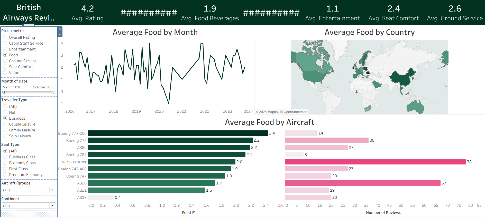

# British Airways Reviews Dashboard   
 
An interactive Tableau dashboard analyzing 1,324 customer reviews of British Airways, covering ratings, service quality, and flight experience across aircraft types, routes, and time.

## Dashboard Preview  

The dashboard includes:
- **KPI header** — Avg. Rating, Avg. Food & Beverages, Avg. Entertainment, Avg. Seat Comfort, Avg. Ground Service
- **Metric selector** — switch between Overall Rating, Cabin Staff Service, Entertainment, Food, Ground Service, Seat Comfort, and Value
- **Average by Month** — trend line from March 2016 to October 2023
- **Average by Country** — filled world map of reviewer origin
- **Average by Aircraft** — breakdown across Boeing and Airbus fleet, paired with review volume
- **Filters** — Traveller Type, Seat Type, Aircraft (group), Continent, and date range slider

## Files

| File | Description |
|---|---|
| `British_Airways_Reviews_Dashboard.twbx` | Packaged Tableau workbook — data + dashboard |
| `ba_reviews.csv` | Source data — 1,324 individual customer reviews |
| `Countries.csv` | Country-to-continent/region lookup table, used to power the map view |

## Data Summary

- **Total reviews:** 1,324
- **Date flown range:** May 2015 – October 2023
- **Verified reviews:** 1,215 (92%) · Not verified: 109
- **Recommended:** 572 yes / 752 no

**Seat type breakdown**
| Seat Type | Reviews |
|---|---|
| Economy Class | 604 |
| Business Class | 501 |
| Premium Economy | 132 |
| First Class | 87 |

**Traveller type breakdown**
| Traveller Type | Reviews |
|---|---|
| Couple Leisure | 446 |
| Solo Leisure | 388 |
| Business | 316 |
| Family Leisure | 173 |

**Average scores (out of 5)**
| Metric | Avg. |
|---|---|
| Overall Rating | 4.2 |
| Cabin Staff Service | 3.3 |
| Ground Service | 3.0 |
| Seat Comfort | 2.9 |
| Value for Money | 2.8 |
| Food & Beverages | 2.7 |
| Entertainment | 2.7 |

## Workbook Structure

The `.twbx` contains 4 worksheets feeding the dashboard:
- **Summary** — KPI header cards
- **Month** — average metric trend by month
- **Map** — average metric by country (joined via `Countries.csv`)
- **Aircraft** — average metric and review count by aircraft type

## How to Use

1. Open `British_Airways_Reviews_Dashboard.twbx` in [Tableau Desktop](https://www.tableau.com/products/desktop) or [Tableau Reader](https://www.tableau.com/products/reader) (free)
2. Use **Pick a metric** to switch what the charts measure
3. Filter by Traveller Type, Seat Type, Aircraft group, Continent, or date range
4. Hover over any chart for exact values

## Requirements

- Tableau Desktop or Tableau Reader (free) to open the `.twbx` file
